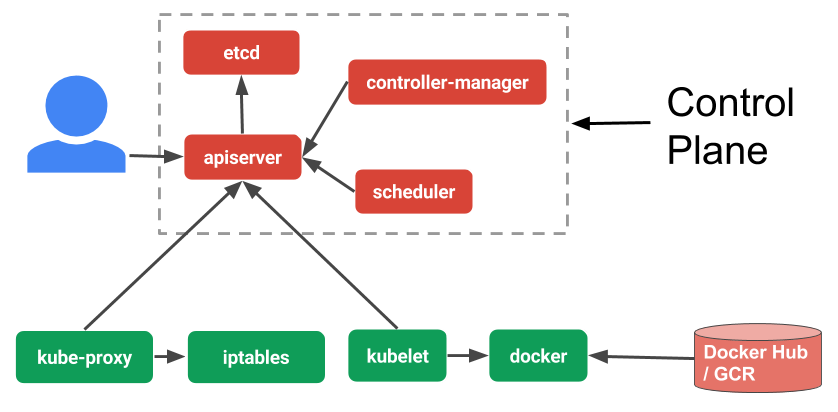
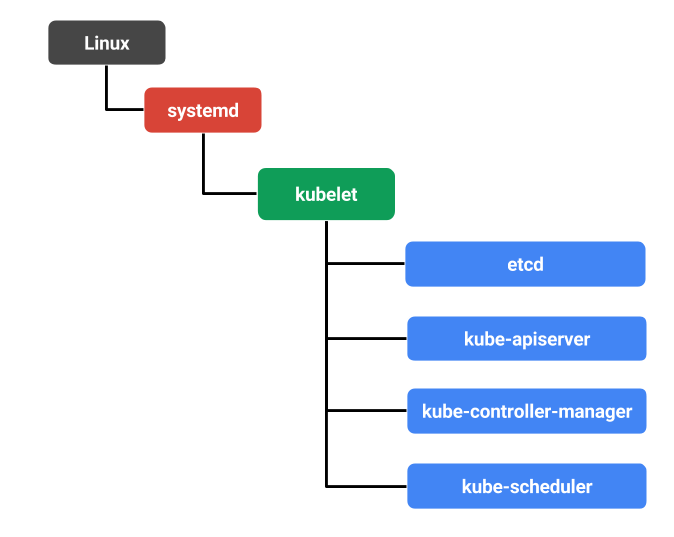

# kubelet

## The Kubernetes Control Plane

The Kubernetes control plane consists of the Kubernetes API server (kube-apiserver), controller manager (kube-controller-manager), and scheduler (kube-scheduler). The API server depends on etcd so an etcd cluster is also required.





These components need to be installed on your master and can be installed in a number of ways. But there are a number of things you have to think about, like how do you make sure each of them are always running? How do you update the components easily with as little impact to the system as possible? You could install them directly on the host machine by downloading them and running them but if they crash then you'd have to restart them manually.

One way to make sure the control plane components are always running is to use systemd. This will make sure they are always running but won't make it easy to upgrade the components later.

## kubeadm and the kubelet

We can see that kubeadm created the necessary certificates for the API, started the control plane components, and installed the essential addons. kubeadm doesn't mention anything about the Kubelet but we can verify that it's running:

```
student@master:~$ ps aux | grep /usr/bin/kubelet | grep -v grep
```
```
root     25280  2.8  1.1 1638724 91788 ?       Ssl  18:19   0:47 /usr/bin/kubelet
--bootstrap-kubeconfig=/etc/kubernetes/bootstrap-kubelet.conf
--kubeconfig=/etc/kubernetes/kubelet.conf
--config=/var/lib/kubelet/config.yaml
--cgroup-driver=systemd
--network-plugin=cni
--pod-infra-container-image=k8s.gcr.io/pause:3.1
--resolv-conf=/run/systemd/resolve/resolv.conf
```

So our Kubelet was started. But how? The Kubelet will monitor the control plane components but what monitors Kubelet and make sure it's always running? This is where we use systemd. Systemd is started as PID 1 so the OS will make sure it is always running, systemd makes sure the Kubelet is running, and the Kubelet makes sure our containers with the control plane components are running.

We have a process architecture something like the following. It's important to note that this is not a diagram of the process tree but rather a diagram showing which components start and monitor each other.



So now we have our Kubelet running our control plane components and it is connected to the API server just like any other Kubelet node. We can verify that:
```
student@master:~$ kubectl get nodes
```
```
NAME     STATUS     ROLES    AGE   VERSION
master   NotReady   master   31m   v1.15.0
```

## Verifying the Control Plane Components

We can see that kubeadm created a /etc/kubernetes/ directory so let's check out what's there.

```
student@master:~$ sudo ls -lh /etc/kubernetes/
```
```
total 40K
-rw------- 1 root root 5.4K Jul 14 18:19 admin.conf
-rw------- 1 root root 5.4K Jul 14 18:19 controller-manager.conf
-rw------- 1 root root 5.4K Jul 14 18:19 kubelet.conf
drwxr-xr-x 2 root root 4.0K Jul 14 18:19 manifests
drwxr-xr-x 3 root root 4.0K Jul 14 18:19 pki
-rw------- 1 root root 5.4K Jul 14 18:19 scheduler.conf
```

The admin.conf and kubelet.conf are yaml files that mostly contain certs used for authentication with the API. The pki directory contains the certificate authority certs, API server certs, and tokens.
```
student@master:~$ sudo ls -lh /etc/kubernetes/pki
```
```
total 60K
-rw-r--r-- 1 root root 1.2K Jul 14 18:19 apiserver.crt
-rw-r--r-- 1 root root 1.1K Jul 14 18:19 apiserver-etcd-client.crt
-rw------- 1 root root 1.7K Jul 14 18:19 apiserver-etcd-client.key
-rw------- 1 root root 1.7K Jul 14 18:19 apiserver.key
-rw-r--r-- 1 root root 1.1K Jul 14 18:19 apiserver-kubelet-client.crt
-rw------- 1 root root 1.7K Jul 14 18:19 apiserver-kubelet-client.key
-rw-r--r-- 1 root root 1.1K Jul 14 18:19 ca.crt
-rw------- 1 root root 1.7K Jul 14 18:19 ca.key
drwxr-xr-x 2 root root 4.0K Jul 14 18:19 etcd
-rw-r--r-- 1 root root 1.1K Jul 14 18:19 front-proxy-ca.crt
-rw------- 1 root root 1.7K Jul 14 18:19 front-proxy-ca.key
-rw-r--r-- 1 root root 1.1K Jul 14 18:19 front-proxy-client.crt
-rw------- 1 root root 1.7K Jul 14 18:19 front-proxy-client.key
-rw------- 1 root root 1.7K Jul 14 18:19 sa.key
-rw------- 1 root root  451 Jul 14 18:19 sa.pub
```
The manifests directory is where things get interesting. In the manifests directory we have a number of json files for our control plane components.

```
student@master:~$ sudo ls -lh /etc/kubernetes/manifests/
```
```
total 16K
-rw------- 1 root root 1.9K Jul 14 18:19 etcd.yaml
-rw------- 1 root root 3.1K Jul 14 18:19 kube-apiserver.yaml
-rw------- 1 root root 3.0K Jul 14 18:19 kube-controller-manager.yaml
-rw------- 1 root root  990 Jul 14 18:19 kube-scheduler.yaml
```
If you noticed earlier the Kubelet was passed the --pod-manifest-path=/etc/kubernetes/manifests flag which tells it to monitor the files in the /etc/kubernetes/manifests directory and makes sure the components defined therein are always running. We can see that they are running my checking with the local Docker to list the running containers.

```
student@master:~$ docker ps --format="table {{.ID}}\t{{.Image}}"
```
```
CONTAINER ID        IMAGE
3267dde8036e        d235b23c3570
3ff22f248c0e        k8s.gcr.io/pause:3.1
4e471cfa6db1        2c4adeb21b4f
1ceaf2853ca4        201c7a840312
f6c1a5648d3a        2d3813851e87
73ea4f93f262        8328bb49b652
3b7989e853f1        k8s.gcr.io/pause:3.1
1bdf242c23bb        k8s.gcr.io/pause:3.1
b6127328a5f1        k8s.gcr.io/pause:3.1
0e488c391801        k8s.gcr.io/pause:3.1
```
Several other containers are running but if we ignore them we can see that etcd, kube-apiserver, kube-controller-manager, and kube-scheduler are running.

How are we able to connect to the containers? If we look at each of the json files in the /etc/kubernetes/manifests directory we can see that they each use the hostNetwork: true option which allows the applications to bind to ports on the host just as if they were running outside of a container.

```
student@master:~$ kubectl get pods --namespace kube-system kube-apiserver-master -o yaml | grep hostNetwork
```
```
  hostNetwork: true
```
[Back](lab01.md)
