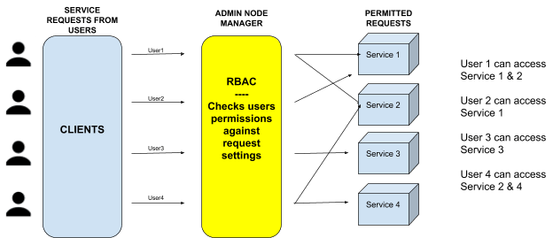

# Kubernetes RBAC
## What is RBAC?
Kubernetes Role-Based Access Control or the (RBAC) system describes how we define different permission levels of unique, validated users or groups in a cluster. It uses granular permission sets defined within a .yaml file to allow access to specific resources and operations.

Starting with Kubernetes 1.6, RBAC is enabled by default and users start with no permissions, and as such, permissions must be explicitly granted by an admin to a specific service or resource. These policies are crucial for effectively securing your cluster. They permit us to specify what types of actions are allowed, depending on the user’s role and their function within the organization.

## The RBAC Model

Basically, the RBAC model is based on three components; `Roles`, `ClusterRoles` and `Subjects`. All k8s clusters create a default set of ClusterRoles, representing common divisions that users can be placed within.

- The “*edit*” role lets users perform basic actions like deploying pods.
- The “*view*” lets users review specific resources that are non-sensitive.
- The “*admin*” role lets a user manage a namespace.
- The “*cluster-admin*” allows access to administer a cluster.

Prerequisites for using Role-Based Access Control
To take advantage of RBAC, you must allow a user the ability to create roles by running the following command:


Example: 'kubectl create clusterrolebinding new-cluster-admin-binding --clusterrole cluster-admin --user'

Afterwards, to start a cluster with RBAC enabled, we would use the flag:

```
student@master:~$ cat /etc/kubernetes/manifests/kube-apiserver.yaml | grep RBAC
```
```
    - --authorization-mode=Node,RBAC
```

Role Based Access Control is comprised of four layers:

1. ClusterRole - permissions assigned to a role that apply to an entire cluster
2. ClusterRoleBinding - binding a ClusterRole to a specific account
3. Role - permissions assigned to a role that apply to a specific namespace
4. RoleBinding - binding a Role to a specific account

### Roles
A Role consists of rules that define a set of permissions for a resource type. Because there is no default deny rules, a Role can only be used to add access to resources within a single virtual cluster. An example would look something like this:

Create a namespace
```
student@master:~$ kubectl create ns test-ns
```
```
namespace/test-ns created
```

File: /home/student/role-readonlypod.yaml

```yaml
kind: Role
apiVersion: rbac.authorization.k8s.io/v1
metadata:
  namespace: test-ns
  name: role-readonlypod
rules:
- apiGroups: [""] # "" indicates the core API group
  resources: ["pods"]
  verbs: ["get", "watch", "list"]
```

In this case, the role defines that a user (*role-readonlypod*) can use the “get”, “watch” or “list” commands for a set of pods in the “*test-ns*” namespace.

```
student@master:~$ kubectl apply -f role-readonlypod.yaml
```
```
role.rbac.authorization.k8s.io/role-readonlypod created
```

```
student@master:~$ kubectl get role -n test-ns
```
```
NAME               AGE
role-readonlypod   95s
```
Describe role role-readonlypod
```
student@master:~$ kubectl --namespace=test-ns describe role role-readonlypod
```
```
Name:         role-readonlypod
Labels:       <none>
Annotations:  kubectl.kubernetes.io/last-applied-configuration:
                {"apiVersion":"rbac.authorization.k8s.io/v1","kind":"Role","metadata":{"annotations":{},"name":"role-readonlypod","namespace":"test-ns"},"...
PolicyRule:
  Resources  Non-Resource URLs  Resource Names  Verbs
  ---------  -----------------  --------------  -----
  pods       []                 []              [get watch list]
```


### ClusterRoles

A ClusterRole can be used to grant the same permissions as a Role but, because they are cluster-scoped, they can also be used to grant wider access to:

- cluster-scoped resources (like nodes)
- non-resource endpoints (like a folder named “/foldertest”)
- namespaced resources (like pods) in and across all namespaces. We would need to run

It contains rules that define a set of permissions across resources like nodes or pods.
An example would look something like this:


File: /home/student/clusterrole-readonlysecrets.yaml
```yaml
kind: ClusterRole
apiVersion: rbac.authorization.k8s.io/v1
metadata:
# "namespace" omitted since ClusterRoles are not namespaced
  name: readonly-secrets
rules:
- apiGroups: [""]
  resources: ["secrets"]
  verbs: ["get", "watch", "list"]
```

```
student@master:~$ kubectl apply -f clusterrole-readonlysecrets.yaml
```
```
clusterrole.rbac.authorization.k8s.io/readonly-secrets created
```
Describe ClusterRole readonly-secrets
```
student@master:~$ kubectl describe clusterrole readonly-secrets
```
```
Name:         readonly-secrets
Labels:       <none>
Annotations:  kubectl.kubernetes.io/last-applied-configuration:
                {"apiVersion":"rbac.authorization.k8s.io/v1","kind":"ClusterRole","metadata":{"annotations":{},"name":"readonly-secrets"},"rules":[{"apiGr...
PolicyRule:
  Resources  Non-Resource URLs  Resource Names  Verbs
  ---------  -----------------  --------------  -----
  secrets    []                 []              [get watch list]
```


### RoleBinding
A RoleBinding is a set of configuration rules that designate a permission set. It binds a role to subjects (Subjects are simply users, a group of users or service accounts). Those permissions can be set for a single namespace (virtual cluster), with a RoleBinding or, cluster-wide with a ClusterRoleBinding.



Let’s allow the group *group1* the ability to read secrets in the “test-ns” namespace:

File: /home/student/rolebinding-readonlysecrets.yaml

```yaml
apiVersion: rbac.authorization.k8s.io/v1
kind: RoleBinding
metadata:
  name: group1
  namespace: test-ns
roleRef:
  apiGroup: rbac.authorization.k8s.io
  kind: Role
  name: role-readonlypod
```

```
student@master:~$ kubectl apply -f rolebinding-readonlysecrets.yaml
```
```
rolebinding.rbac.authorization.k8s.io/group1 created
```

Because we used a RoleBinding, these functions only apply within the RoleBinding’s namespace. In this case, a user within the “gruppo1” group can view secrets in the “test-ns” namespace but not in a different namespace.

### ClusterRoleBindings

A ClusterRoleBinding defines which users have permissions to access which ClusterRoles. Because a “role” contains rules that represent a set of permissions, ClusterRoleBindings extend the defined permissions for:

- unique namespace in resources like nodes
- resources in all namespaces in a cluster
- undefined resource endpoints like ”/namefolder”

An example of creating a ClusterRoleBinding for user01, user02, and group2 using the cluster-admin ClusterRole


File: /home/student/clusterrolebinding-cluster-admin.yaml

```yaml
apiVersion: rbac.authorization.k8s.io/v1
kind: ClusterRoleBinding
metadata:
  name: cluster-admin
roleRef:
  apiGroup: rbac.authorization.k8s.io
  kind: ClusterRole
  name: cluster-admin
subjects:
- apiGroup: rbac.authorization.k8s.io
  kind: User
  name: user01
- apiGroup: rbac.authorization.k8s.io
  kind: User
  name: user02
- apiGroup: rbac.authorization.k8s.io
  kind: Group
  name: group2
```

```
student@master:~$ kubectl apply -f clusterrolebinding-cluster-admin.yaml
```
```
clusterrolebinding.rbac.authorization.k8s.io/cluster-admin configured
```


```
student@master:~$ kubectl get clusterrolebinding | grep cluster-admin
```
```
cluster-admin                                          6h35m
```

Groups are determined by the configured authentication method. See https://kubernetes.io/docs/admin/authentication/ for details about how each authenticator determines the group membership of the authenticated user.

# Service Accounts

Sometimes, we want to grant pods secure Kubernetes API access (ex for monitoring or logging purposes), and we'd like to govern that access with the same sort of RBAC rules we apply to our human users. For this, there are *service accounts*.

By the end of this exercise, you should be able to:

 - Configure permissions for a service account
 - Identify the service account credentials in a pod
 - Use service account credentials to securely access a pod

## Setting up a Service Account

Create a custom service account in the `test-ns` namespace:

File: /home/student/serviceaccount-user-for-logging.yaml

```yaml
apiVersion: v1
kind: ServiceAccount
metadata:
  name: user-for-logging
  namespace: test-ns
```

```
student@master:~$ kubectl apply -f serviceaccount-user-for-logging.yaml
```
```
serviceaccount/user-for-logging created
```

Let's binding Role *role-readonlypod* with a ServiceAccount created.

```
student@master:~$ kubectl create rolebinding -n test-ns rolebinding-for-readonly-pod --role=role-readonlypod --serviceaccount=test-ns:user-for-logging
```
```
rolebinding.rbac.authorization.k8s.io/rolebinding-for-readonly-pod created
```


```
student@master:~$ kubectl describe rolebinding -n test-ns
```
```
Name:         group1
Labels:       <none>
Annotations:  <none>
Role:
  Kind:  ClusterRole
  Name:  readonly-secrets
Subjects:
  Kind  Name  Namespace
  ----  ----  ---------


Name:         rolebinding-for-readonly-pod
Labels:       <none>
Annotations:  <none>
Role:
  Kind:  Role
  Name:  role-readonlypod
Subjects:
  Kind            Name              Namespace
  ----            ----              ---------
  ServiceAccount  user-for-logging  test-ns
```


To test authorization, you may use the can-i argument as follows. To test whether the ServiceAccount may list pods, input:

```
student@master:~$ kubectl -n test-ns  auth can-i --as=system:serviceaccount:test-ns:user-for-logging list pods
```
```
yes
```


To test whether the ServiceAccount may list services, input:
```
student@master:~$ kubectl -n test-ns  auth can-i --as=system:serviceaccount:test-ns:user-for-logging list services
```
```
no
```


Let's delete all objects created:

Deleting namespace all objects inside it will be deleted
```
student@master:~$ kubectl delete ns test-ns
```
```
namespace "test-ns" deleted
```

Delete ClusterRole
```
student@master:~$ kubectl delete clusterrole readonly-secrets
```
```
clusterrole.rbac.authorization.k8s.io "readonly-secrets" deleted
```
Delete ClusterRoleBinding
```
student@master:~$ kubectl delete clusterrolebinding cluster-admin
```
```
clusterrolebinding.rbac.authorization.k8s.io "cluster-admin" deleted
```


Now you are able to create all object, we can see an example how to use it.
