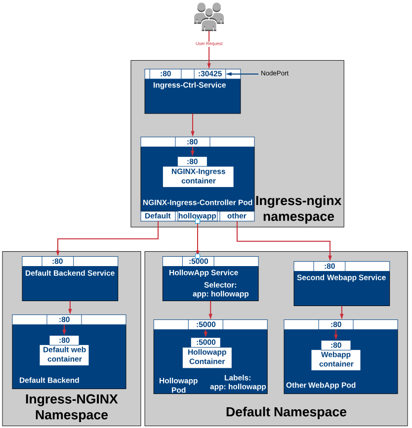

# Kubernetes Ingresses

Kubernetes `Ingress` objects allow more sophisticated routing patterns to be established for traffic originating outside your cluster. By the end of this exercise, you should be able to:

 - Set up a nginx-based Kubernetes `IngressController`
 - Configure L7 routing, path based routing and sticky sessions with a Kubernetes `Ingress` object

## Setting up an IngressController

Before we can create any `Ingress` objects, we need an `IngressController` to manage them and provide the actual proxy to do the routing; we'll set up an nginx-based `IngressController`.

1.  First we need a Kubernetes *service account* for our `IngressController`, to allow it to automatically make calls to the Kube API to find out the scheduling and networking configuration it will need. Start by creating a namespace for the `IngressController` and its service account




### Create Namespace ingress-nginx

File: /home/student/nginx-ns.yaml

```yaml
apiVersion: v1
kind: Namespace
metadata:
  name: ingress-nginx
  labels:
    app.kubernetes.io/name: ingress-nginx
    app.kubernetes.io/part-of: ingress-nginx
```
student@master:~$ kubectl apply -f nginx-ns.yaml
```
namespace/ingress-nginx created
```

### Create the Kubernetes manifest
First define a few ConfigMaps that our Ingress Controller requires to hold its configuration.

File: /home/student/nginx-configmap.yaml
```yaml
kind: ConfigMap
apiVersion: v1
metadata:
  name: nginx-configuration
  namespace: ingress-nginx
  labels:
    app.kubernetes.io/name: ingress-nginx
    app.kubernetes.io/part-of: ingress-nginx

---
kind: ConfigMap
apiVersion: v1
metadata:
  name: tcp-services
  namespace: ingress-nginx
  labels:
    app.kubernetes.io/name: ingress-nginx
    app.kubernetes.io/part-of: ingress-nginx

---
kind: ConfigMap
apiVersion: v1
metadata:
  name: udp-services
  namespace: ingress-nginx
  labels:
    app.kubernetes.io/name: ingress-nginx
    app.kubernetes.io/part-of: ingress-nginx
```

```
student@master:~$ kubectl apply -f nginx-configmap.yaml
```
```
configmap/nginx-configuration created
configmap/tcp-services created
configmap/udp-services created
```


### Define a serviceaccount

Next define a ServiceAccount, Role, and RoleBinding to provide the ingress controller with the minimum permissions needed to perform its function as a reference of Kubernetes for [ingress-nginx](https://kubernetes.github.io/ingress-nginx/deploy/rbac/)

In order for RBAC to be applied to an `nginx-ingress-controller`, that controller should be assigned to a ServiceAccount. That ServiceAccount should be bound to the Roles and ClusterRoles defined for the `nginx-ingress-controller`.

One ServiceAccount is created in this example, `nginx-ingress-serviceaccount`.

File: /home/student/nginx-serviceaccount.yaml

```yaml
---
  apiVersion: v1
  kind: ServiceAccount
  metadata:
    name: nginx-ingress-serviceaccount
    namespace: ingress-nginx
    labels:
      app.kubernetes.io/name: ingress-nginx
      app.kubernetes.io/part-of: ingress-nginx
```

```
student@master:~$ kubectl apply -f nginx-serviceaccount.yaml
```
```
serviceaccount/nginx-ingress-serviceaccount created
```

### Permissions Granted in this example

There are two sets of permissions defined in this example. Cluster-wide permissions defined by the ClusterRole named `nginx-ingress-clusterrole`, and namespace specific permissions defined by the Role named `nginx-ingress-role`.

#### Cluster Permissions
These permissions are granted in order for the nginx-ingress-controller to be able to function as an ingress across the cluster. These permissions are granted to the ClusterRole named nginx-ingress-clusterrole

- `configmaps`, `endpoints`, `nodes`, `pods`, `secrets`: list, watch
- `nodes`: get
- `services`, `ingresses`: get, list, watch
- `events`: create, patch
- `ingresses/status`: update


File: /home/student/nginx-clusterrole.yaml

```yaml
apiVersion: rbac.authorization.k8s.io/v1beta1
kind: ClusterRole
metadata:
  name: nginx-ingress-clusterrole
  labels:
    app.kubernetes.io/name: ingress-nginx
    app.kubernetes.io/part-of: ingress-nginx
rules:
  - apiGroups:
      - ""
    resources:
      - configmaps
      - endpoints
      - nodes
      - pods
      - secrets
    verbs:
      - list
      - watch
  - apiGroups:
      - ""
    resources:
      - nodes
    verbs:
      - get
  - apiGroups:
      - ""
    resources:
      - services
    verbs:
      - get
      - list
      - watch
  - apiGroups:
      - ""
    resources:
      - events
    verbs:
      - create
      - patch
  - apiGroups:
      - "extensions"
      - "networking.k8s.io"
    resources:
      - ingresses
    verbs:
      - get
      - list
      - watch
  - apiGroups:
      - "extensions"
      - "networking.k8s.io"
    resources:
      - ingresses/status
    verbs:
      - update

```

```
student@master:~$ kubectl apply -f nginx-clusterrole.yaml
```
```
clusterrole.rbac.authorization.k8s.io/nginx-ingress-clusterrole created
```

#### Namespace Permissions
These permissions are granted specific to the nginx-ingress namespace. These permissions are granted to the Role named `nginx-ingress-role`

- `configmaps`, `pods`, `secrets`: get
- `endpoints`: get

Furthermore to support leader-election, the nginx-ingress-controller needs to have access to a `configmap` using the resourceName `ingress-controller-leader-nginx`

> Note that resourceNames can NOT be used to limit requests using the “create” verb because authorizers only have access to information that can be obtained from the request URL, method, and headers (resource names in a “create” request are part of the request body).

- `configmaps`: get, update (for resourceName `ingress-controller-leader-nginx`)
- `configmaps`: create

This resourceName is the concatenation of the `election-id` and the `ingress-class` as defined by the ingress-controller, which defaults to:

- `election-id`: ingress-controller-leader
- `ingress-class`: nginx
- `resourceName` : <election-id>-<ingress-class>

File: /home/student/nginx-role.yaml

```yaml
---
  apiVersion: rbac.authorization.k8s.io/v1beta1
  kind: Role
  metadata:
    name: nginx-ingress-role
    namespace: ingress-nginx
    labels:
      app.kubernetes.io/name: ingress-nginx
      app.kubernetes.io/part-of: ingress-nginx
  rules:
    - apiGroups:
        - ""
      resources:
        - configmaps
        - pods
        - secrets
        - namespaces
      verbs:
        - get
    - apiGroups:
        - ""
      resources:
        - configmaps
      resourceNames:
        # Defaults to "<election-id>-<ingress-class>"
        # Here: "<ingress-controller-leader>-<nginx>"
        # This has to be adapted if you change either parameter
        # when launching the nginx-ingress-controller.
        - "ingress-controller-leader-nginx"
      verbs:
        - get
        - update
    - apiGroups:
        - ""
      resources:
        - configmaps
      verbs:
        - create
    - apiGroups:
        - ""
      resources:
        - endpoints
      verbs:
        - get
```

```
student@master:~$ kubectl apply -f nginx-role.yaml
```
```
role.rbac.authorization.k8s.io/nginx-ingress-role created
```

### Bindings
The ServiceAccount `nginx-ingress-serviceaccount` is bound to the Role `nginx-ingress-role` and the ClusterRole `nginx-ingress-clusterrole`.

The serviceAccountName associated with the containers in the deployment must match the **serviceAccount**. The namespace references in the Deployment metadata, container arguments, and POD_NAMESPACE should be in the nginx-ingress namespace.

#### ClusterRoleBinding

File: /home/student/nginx-clusterrolebinding.yaml

```yaml
apiVersion: rbac.authorization.k8s.io/v1beta1
kind: ClusterRoleBinding
metadata:
  name: nginx-ingress-clusterrole-nisa-binding
  labels:
    app.kubernetes.io/name: ingress-nginx
    app.kubernetes.io/part-of: ingress-nginx
roleRef:
  apiGroup: rbac.authorization.k8s.io
  kind: ClusterRole
  name: nginx-ingress-clusterrole
subjects:
  - kind: ServiceAccount
    name: nginx-ingress-serviceaccount
    namespace: ingress-nginx
```

```
student@master:~$ kubectl apply -f nginx-clusterrolebinding.yaml
```
```
clusterrolebinding.rbac.authorization.k8s.io/nginx-ingress-clusterrole-nisa-binding created
```

#### RoleBinding

File: /home/student/nginx-rolebinding.yaml

```yaml
apiVersion: rbac.authorization.k8s.io/v1beta1
kind: RoleBinding
metadata:
  name: nginx-ingress-role-nisa-binding
  namespace: ingress-nginx
  labels:
    app.kubernetes.io/name: ingress-nginx
    app.kubernetes.io/part-of: ingress-nginx
roleRef:
  apiGroup: rbac.authorization.k8s.io
  kind: Role
  name: nginx-ingress-role
subjects:
  - kind: ServiceAccount
    name: nginx-ingress-serviceaccount
    namespace: ingress-nginx
```

```
student@master:~$ kubectl apply -f nginx-rolebinding.yaml
```
```
rolebinding.rbac.authorization.k8s.io/nginx-ingress-role-nisa-binding created
```

Now define a Deployment for your default backend. When the ingress controller is unsure of the intended destination of a given request, it will route the request to this backend. It’s important to note here that the default backend can be any application so long as it serves a ‘404’ page at ‘/’ and ‘200’ response at ‘/healthz’.

File: /home/student/nginx-default-http-backend.yaml

```yaml
---
apiVersion: apps/v1
kind: Deployment
metadata:
  name: default-http-backend
  namespace: ingress-nginx
  labels:
    app: default-http-backend
spec:
  replicas: 1
  selector:
    matchLabels:
      app: default-http-backend
  template:
    metadata:
      labels:
        app: default-http-backend
    spec:
      terminationGracePeriodSeconds: 60
      containers:
      - name: default-http-backend
        image: gcr.io/google_containers/defaultbackend:1.4
        livenessProbe:
          httpGet:
            path: /healthz
            port: 8080
            scheme: HTTP
          initialDelaySeconds: 30
          timeoutSeconds: 5
        ports:
        - containerPort: 8080
        resources:
          limits:
            cpu: 10m
            memory: 20Mi
```

```
student@master:~$ kubectl apply -f nginx-default-http-backend.yaml
```
```
deployment.apps/default-http-backend created
```

You will also need to define a Service to front the default backend.

File: /home/student/nginx-svc-default-http-backend.yaml

```yaml
---
apiVersion: v1
kind: Service
metadata:
  name: default-http-backend
  namespace: ingress-nginx
  labels:
    app: default-http-backend
spec:
  ports:
  - port: 80
    targetPort: 8080
  selector:
    app: default-http-backend
```

```
student@master:~$ kubectl apply -f nginx-svc-default-http-backend.yaml
```
```
service/default-http-backend created
```

Now define a Deployment to manage the ingress controller. There are few important things to call attention to here.

1. The “serviceAccountName” in the template pod spec matches the ServiceAccount we defined above. If they don’t match the the ingress controller won’t be granted with the permissions needed to operate.

2. The “livenessProbe” and “readinessProbe” are both configured to watch the ingress controllers ‘/healthz’ endpoint. This ensures only healthy ingress controller pods will be in circulation at any given time and any unhealthy ones will be restarted.

3. By setting the “–watch-namespace=$(POD_NAMESPACE)” flag via the containers “command” field you are configuring the ingress controller to only watch for Ingress resources in its own namespace.

4. To make this manifest as reusable as possible the namespace name is dynamically populated by Kubernetes Downward API.

File: /home/student/nginx-ingress-controller.yaml

```yaml
---
  apiVersion: apps/v1
  kind: Deployment
  metadata:
    name: nginx-ingress-controller
    namespace: ingress-nginx
    labels:
      app.kubernetes.io/name: ingress-nginx
      app.kubernetes.io/part-of: ingress-nginx
  spec:
    replicas: 1
    selector:
      matchLabels:
        app.kubernetes.io/name: ingress-nginx
        app.kubernetes.io/part-of: ingress-nginx
    template:
      metadata:
        labels:
          app.kubernetes.io/name: ingress-nginx
          app.kubernetes.io/part-of: ingress-nginx
        annotations:
          prometheus.io/port: "10254"
          prometheus.io/scrape: "true"
      spec:
        serviceAccountName: nginx-ingress-serviceaccount
        containers:
          - name: nginx-ingress-controller
            image: quay.io/kubernetes-ingress-controller/nginx-ingress-controller:0.25.1
            args:
              - /nginx-ingress-controller
              - --configmap=$(POD_NAMESPACE)/nginx-configuration
              - --tcp-services-configmap=$(POD_NAMESPACE)/tcp-services
              - --udp-services-configmap=$(POD_NAMESPACE)/udp-services
              - --publish-service=$(POD_NAMESPACE)/ingress-nginx
              - --annotations-prefix=nginx.ingress.kubernetes.io
            securityContext:
              allowPrivilegeEscalation: true
              capabilities:
                drop:
                  - ALL
                add:
                  - NET_BIND_SERVICE
              # www-data -> 33
              runAsUser: 33
            env:
              - name: POD_NAME
                valueFrom:
                  fieldRef:
                    fieldPath: metadata.name
              - name: POD_NAMESPACE
                valueFrom:
                  fieldRef:
                    fieldPath: metadata.namespace
            ports:
              - name: http
                containerPort: 80
              - name: https
                containerPort: 443
            livenessProbe:
              failureThreshold: 3
              httpGet:
                path: /healthz
                port: 10254
                scheme: HTTP
              initialDelaySeconds: 10
              periodSeconds: 10
              successThreshold: 1
              timeoutSeconds: 10
            readinessProbe:
              failureThreshold: 3
              httpGet:
                path: /healthz
                port: 10254
                scheme: HTTP
              periodSeconds: 10
              successThreshold: 1
              timeoutSeconds: 10

```

```
student@master:~$ kubectl apply -f nginx-ingress-controller.yaml
```
```
deployment.apps/nginx-ingress-controller created
```

Almost there, but assuming your Kubernetes cluster is enforcing NetworkPolicies you will need to define two — one to allow all traffic into your ingress controller and another for your default backend.

File: /home/student/nginx-networkpolicy.yaml

```yaml
---
apiVersion: networking.k8s.io/v1
kind: NetworkPolicy
metadata:
  name: ingress-nginx-network-policy
  namespace: ingress-nginx
  labels:
    app: ingress-nginx
spec:
  podSelector:
    matchLabels:
      app: ingress-nginx
  ingress:
  - {}

---
apiVersion: networking.k8s.io/v1
kind: NetworkPolicy
metadata:
  name: default-http-backend-network-policy
  namespace: ingress-nginx
spec:
  podSelector:
    matchLabels:
      app: default-http-backend
  ingress:
  - {}
```

```
student@master:~$ kubectl apply -f nginx-networkpolicy.yaml
```
```
networkpolicy.networking.k8s.io/ingress-nginx-network-policy created
networkpolicy.networking.k8s.io/default-http-backend-network-policy created
```


Finally lets define a Service to front this deployment. Setting the type value to “LoadBalancer” in the Service spec will ensure Kubernetes provisions a load balancer with a public IP.
In this example we will not use a `LoadBalancer` because we are not in a public cloud like AWS or Azure, and we will use `NodePort`

File: /home/student/nginx-svc-ingress.yaml

```yaml
---
apiVersion: v1
kind: Service
metadata:
  name: ingress-nginx
  namespace: ingress-nginx
spec:
  type: NodePort
  ports:
  - name: http
    port: 80
    targetPort: 80
    protocol: TCP
  - name: https
    port: 443
    targetPort: 443
    protocol: TCP
  selector:
    app.kubernetes.io/name: ingress-nginx
    app.kubernetes.io/part-of: ingress-nginx
```

```
student@master:~$ kubectl apply -f nginx-svc-ingress.yaml
```
```
service/ingress-nginx created
```

```
student@master:~$ kubectl describe -n ingress-nginx service ingress-nginx
```
```
Name:                     ingress-nginx
Namespace:                ingress-nginx
Labels:                   <none>
Annotations:              kubectl.kubernetes.io/last-applied-configuration:
                            {"apiVersion":"v1","kind":"Service","metadata":{"annotations":{},"name":"ingress-nginx","namespace":"ingress-nginx"},"spec":{"ports":[{"na...
Selector:                 app=ingress-nginx
Type:                     NodePort
IP:                       10.105.220.45
Port:                     http  80/TCP
TargetPort:               80/TCP
NodePort:                 http  32018/TCP
Endpoints:                <none>
Port:                     https  443/TCP
TargetPort:               443/TCP
NodePort:                 https  31236/TCP
Endpoints:                <none>
Session Affinity:         None
External Traffic Policy:  Cluster
Events:                   <none>
```

In this example, the public HTTP port is 32018 - you'll need this later, when you want to connect to a Kubernetes service via your `IngressController`.

## Configuring L7 and Path-Based Routing

1.  Start by creating two deployments, each with a `ClusterIP` service pointing at them which we'll route to at L7 and by path. The `ClusterIP` services are named `service-1` (on port 3000), and `service-2` (on port 4000).

Let's create the first deployment `service-1`

File: /home/student/nginx-deploy-service-1.yaml

```yaml
apiVersion: apps/v1
kind: Deployment
metadata:
  name: service-1
  namespace: default
  labels:
    app: service-1
spec:
  replicas: 1
  selector:
    matchLabels:
      app: service-1
  template:
    metadata:
      labels:
        app: service-1
    spec:
      containers:
      - name: service-1
        image: containous/whoami
        ports:
        - containerPort: 80
```

```
student@master:~$ kubectl apply -f nginx-deploy-service-1.yaml
```
```
deployment.apps/service-1 created
```

Create a service for deployment `service-1`

File: /home/student/nginx-svc-service-1.yaml

```yaml
---
kind: Service
apiVersion: v1
metadata:
  name: service-1
  namespace: default
spec:
  selector:
    app: service-1
  ports:
  - port: 3000
    targetPort: 80
```

```
student@master:~$ kubectl apply -f nginx-svc-service-1.yaml
```
```
service/service-1 created
```

Create the second deployment `service-2`

File: /home/student/nginx-deploy-service-2.yaml

```yaml
---
apiVersion: apps/v1
kind: Deployment
metadata:
  name: service-2
  namespace: default
  labels:
    app: service-2
spec:
  replicas: 1
  selector:
    matchLabels:
      app: service-2
  template:
    metadata:
      labels:
        app: service-2
    spec:
      containers:
      - name: service-2
        image: containous/whoami
        ports:
        - containerPort: 80
```

```
student@master:~$ kubectl apply -f nginx-deploy-service-2.yaml
```
```
deployment.apps/service-2 created
```

Create a service for deployment `service-2`

File: /home/student/nginx-svc-service-2.yaml

```yaml
---
kind: Service
apiVersion: v1
metadata:
  name: service-2
  namespace: default
spec:
  selector:
    app: service-2
  ports:
  - port: 4000
    targetPort: 80
```

```
student@master:~$ kubectl apply -f nginx-svc-service-2.yaml
```
```
service/service-2 created
```


2.  We are now ready to define **Ingress** resources that defines routing rules for the two services:

File: /home/student/nginx-ingress.yaml

```yaml
apiVersion: extensions/v1beta1
kind: Ingress
metadata:
  name: service-ingress
  namespace: default
  annotations:
    kubernetes.io/ingress.class: nginx
    ingress.kubernetes.io/rewrite-target: /
spec:
  rules:
  - host: test-website.com
    http:
      paths:
      - path: /path1
        backend:
          serviceName: service-1
          servicePort: 3000
      - path: /path2
        backend:
          serviceName: service-2
          servicePort: 4000
```

This will define and configure the IngressController with the route mapping :
 - test-website.com/path1 ---> service "service-1"
 - test-website.com/path2 ---> service "service-2"

```
student@master:~$ kubectl apply -f nginx-ingress.yaml
```
```
ingress.extensions/service-ingress created
```

3.  In your terminal use `curl` to test the routing, where `<public IP>` is the public IP address of any cluster node and `<port>` is the `NodePort` of the `IngressController` service as discussed further up (in my example it was 32018):

`curl -H "Host: test-website.com" IP-node:32018/path1`
`curl -H "Host: test-website.com" IP-node:32018/path2`

```
student@master:~$ curl -H "Host: test-website.com" http://10.10.98.199:32018/path2
```
```
Hostname: service-2-d66575d5c-5dvs9
IP: 127.0.0.1
IP: 192.168.32.198
GET /path2 HTTP/1.1
Host: test-website.com
User-Agent: curl/7.47.0
Accept: */*
X-Forwarded-For: 192.168.223.0
X-Forwarded-Host: test-website.com
X-Forwarded-Port: 80
X-Forwarded-Proto: http
X-Original-Uri: /path2
X-Real-Ip: 192.168.223.0
X-Request-Id: 2226e219218950ce0eb7b6e58f5fba6c
X-Scheme: http
```

```
student@master:~$ curl -H "Host: test-website.com" http://10.10.98.199:32018/path1
```
```
Hostname: service-1-85fd448f-jjbfj
IP: 127.0.0.1
IP: 192.168.131.198
GET /path1 HTTP/1.1
Host: test-website.com
User-Agent: curl/7.47.0
Accept: */*
X-Forwarded-For: 192.168.223.0
X-Forwarded-Host: test-website.com
X-Forwarded-Port: 80
X-Forwarded-Proto: http
X-Original-Uri: /path1
X-Real-Ip: 192.168.223.0
X-Request-Id: a455fc9c48a571279b88e8f92210852a
X-Scheme: http
```

Now scale your deployment.

```
student@master:~$ kubectl scale deploy service-1 --replicas=5
```
```
deployment.extensions/service-1 scaled
```

```
student@master:~$ kubectl get deploy service-1
```
```
NAME        READY   UP-TO-DATE   AVAILABLE   AGE
service-1   5/5     5            5           5h18m
```

```
student@master:~$ curl -H "Host: test-website.com" http://10.10.98.199:32018/path1 --silent  --stderr - | grep Hostname
```
```
Hostname: service-1-85fd448f-xz5gs
```

```
student@master:~$ curl -H "Host: test-website.com" http://10.10.98.199:32018/path1 --silent  --stderr - | grep Hostname
```
```
Hostname: service-1-85fd448f-h42vk
```

```
student@master:~$ curl -H "Host: test-website.com" http://10.10.98.199:32018/path1 --silent  --stderr - | grep Hostname
```
```
Hostname: service-1-85fd448f-wqwp9
```

```
student@master:~$ curl -H "Host: test-website.com" http://10.10.98.199:32018/path1 --silent  --stderr - | grep Hostname
```
```
Hostname: service-1-85fd448f-h42vk
```

```
student@master:~$ curl -H "Host: test-website.com" http://10.10.98.199:32018/path1 --silent  --stderr - | grep Hostname
```
```
Hostname: service-1-85fd448f-h42vk
```
As you can see the pod change in random way.
Now delete the ingress

```
student@master:~$ kubectl delete ingress service-ingress
```
```
ingress.extensions "service-ingress" deleted
```

## Configuring Sticky Sessions

3.  Create a new ingress via the following yaml:

File: /home/student/nginx-ingress-sticky.yaml

```yaml
apiVersion: extensions/v1beta1
kind: Ingress
metadata:
  name: sticky-session-service-1
  namespace: default
  annotations:
    kubernetes.io/ingress.class: nginx
    nginx.ingress.kubernetes.io/affinity: cookie
    nginx.ingress.kubernetes.io/session-cookie-name: desocookie
    nginx.ingress.kubernetes.io/session-cookie-hash: sha1
spec:
  rules:
  - host: test-website.com
    http:
      paths:
      - backend:
          serviceName: service-1
          servicePort: 3000
```

This instructs k8s to provide and check the value of the `desocookie` cookie in a request, and route the request to the `service-1` pod corresponding to the value of that cookie.

```
student@master:~$ kubectl apply -f nginx-ingress-sticky.yaml
```
```
ingress.extensions/sticky-session-service-1 created
```

```
student@master:~$ kubectl describe ingress sticky-session-service-1
```
```
Name:             sticky-session-service-1
Namespace:        default
Address:          
Default backend:  default-http-backend:80 (<none>)
Rules:
  Host              Path  Backends
  ----              ----  --------
  test-website.com  
                    /path1   service-1:3000 (192.168.131.198:80,192.168.131.200:80,192.168.148.7:80 + 2 more...)
Annotations:
  nginx.ingress.kubernetes.io/session-cookie-name:   route
  kubectl.kubernetes.io/last-applied-configuration:  {"apiVersion":"extensions/v1beta1","kind":"Ingress","metadata":{"annotations":{"kubernetes.io/ingress.class":"nginx","nginx.ingress.kubernetes.io/affinity":"cookie","nginx.ingress.kubernetes.io/session-cookie-hash":"sha1","nginx.ingress.kubernetes.io/session-cookie-name":"route"},"name":"sticky-session-service-1","namespace":"default"},"spec":{"rules":[{"host":"test-website.com","http":{"paths":[{"backend":{"serviceName":"service-1","servicePort":3000},"path":"/path1"}]}}]}}

  kubernetes.io/ingress.class:                      nginx
  nginx.ingress.kubernetes.io/affinity:             cookie
  nginx.ingress.kubernetes.io/session-cookie-hash:  sha1
Events:
  Type    Reason  Age   From                      Message
  ----    ------  ----  ----                      -------
  Normal  CREATE  8s    nginx-ingress-controller  Ingress default/sticky-session-service-1
```

```
student@master:~$ curl -H "Host: test-website.com" http://10.10.98.199:32018/path1 --silent -b "desocookie=user1" --stderr - | grep Hostname
```
```
Hostname: service-1-85fd448f-xz5gs
```

```
student@master:~$ curl -H "Host: test-website.com" http://10.10.98.199:32018/path1 --silent -b "desocookie=user5" --stderr - | grep Hostname
```
```
Hostname: service-1-85fd448f-jjbfj
```

```
student@master:~$ curl -H "Host: test-website.com" http://10.10.98.199:32018/path1 --silent -b "desocookie=user1" --stderr - | grep Hostname
```
```
Hostname: service-1-85fd448f-xz5gs
```

```
student@master:~$ curl -H "Host: test-website.com" http://10.10.98.199:32018/path1 --silent -b "desocookie=user5" --stderr - | grep Hostname
```
```
Hostname: service-1-85fd448f-jjbfj
```

4.  The Ingress we've created will automatically generate sticky session tokens on request; use `curl` to record a sticky session cookie (this would be done automatically by a browser, but we need to manage it by hand with `curl`), where `<public IP>` is the IP address of any cluster node and `<port>` is the `NodePort` of the `IngressController`:

```
student@master:~$ for N in `seq 1 10`; do curl -H "Host: test-website.com" http://10.10.98.199:32018/path1 --silent -b "desocookie=user1" --stderr - | grep Hostname; done;
```
```
Hostname: service-1-85fd448f-xz5gs
Hostname: service-1-85fd448f-xz5gs
Hostname: service-1-85fd448f-xz5gs
Hostname: service-1-85fd448f-xz5gs
Hostname: service-1-85fd448f-xz5gs
Hostname: service-1-85fd448f-xz5gs
Hostname: service-1-85fd448f-xz5gs
Hostname: service-1-85fd448f-xz5gs
Hostname: service-1-85fd448f-xz5gs
Hostname: service-1-85fd448f-xz5gs
```


The cookie ensures the request gets sent to the same pod, every time.

6.  Clean up by deleting all resources created.

```
student@master:~$ kubectl delete ns ingress-nginx
```
```
namespace "ingress-nginx" deleted
```

```
student@master:~$ kubectl delete clusterrole nginx-ingress-clusterrole
```
```
clusterrole.rbac.authorization.k8s.io "nginx-ingress-clusterrole" deleted
```

```
student@master:~$ kubectl delete clusterrolebinding nginx-ingress-clusterrole-nisa-binding
```
```
clusterrolebinding.rbac.authorization.k8s.io "nginx-ingress-clusterrole-nisa-binding" deleted
```

```
student@master:~$ kubectl delete deploy service-1
```
```
deployment.extensions "service-1" deleted
```

```
student@master:~$ kubectl delete deploy service-2
```
```
deployment.extensions "service-2" deleted
```

```
student@master:~$ kubectl delete svc service-1
```
```
service "service-1" deleted
```

```
student@master:~$ kubectl delete svc service-2
```
```
service "service-2" deleted
```

```
student@master:~$ kubectl delete ingress sticky-session-service-1
```
```
ingress.extensions "sticky-session-service-1" deleted
```

[Back](lab10.md)
