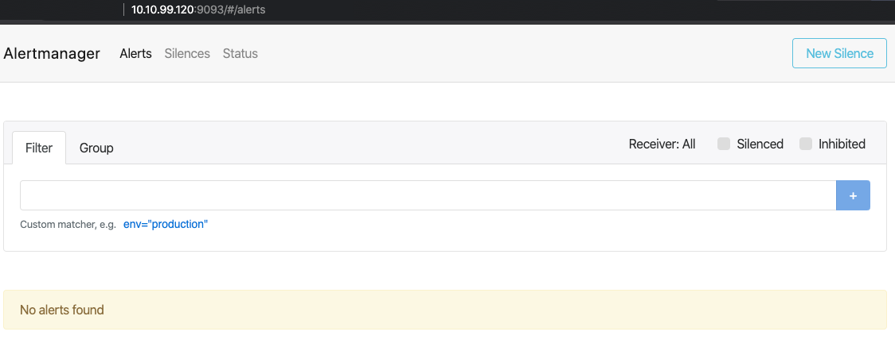

# AlertManager

## What is it AlertManager

Monitoring is incomplete without alerting. We have already looked in monitoring with Prometheus in the previous article. 

AlertManager is a single binary which handles alerts sent by Prometheus server and notifies end user.

The Alertmanager handles alerts sent by client applications such as the Prometheus server. It takes care of deduplicating, grouping, and routing them to the correct receiver integration such as email, PagerDuty, or OpsGenie. It also takes care of silencing and inhibition of alerts.

The following describes the core concepts the Alertmanager implements. Consult the configuration documentation to learn how to use them in more detail.

## Grouping

Grouping categorizes alerts of similar nature into a single notification. This is especially useful during larger outages when many systems fail at once and hundreds to thousands of alerts may be firing simultaneously.

Example: Dozens or hundreds of instances of a service are running in your cluster when a network partition occurs. Half of your service instances can no longer reach the database. Alerting rules in Prometheus were configured to send an alert for each service instance if it cannot communicate with the database. As a result hundreds of alerts are sent to Alertmanager.

As a user, one only wants to get a single page while still being able to see exactly which service instances were affected. Thus one can configure Alertmanager to group alerts by their cluster and alertname so it sends a single compact notification.

Grouping of alerts, timing for the grouped notifications, and the receivers of those notifications are configured by a routing tree in the configuration file.

## Inhibition

Inhibition is a concept of suppressing notifications for certain alerts if certain other alerts are already firing.

Example: An alert is firing that informs that an entire cluster is not reachable. Alertmanager can be configured to mute all other alerts concerning this cluster if that particular alert is firing. This prevents notifications for hundreds or thousands of firing alerts that are unrelated to the actual issue.

Inhibitions are configured through the Alertmanager's configuration file.

## Silences
Silences are a straightforward way to simply mute alerts for a given time. A silence is configured based on matchers, just like the routing tree. Incoming alerts are checked whether they match all the equality or regular expression matchers of an active silence. If they do, no notifications will be sent out for that alert.

Silences are configured in the web interface of the Alertmanager.

## Deploying Alertmanager

Before deploying, please update “<your_slack_hook>” , “<your_victorops_hook>” , ‘<YOUR_API_KEY>’ . If you use a notification channel other than these, please follow this documentation and update the config.

```bash
kubectl apply -f alertmanager
```

> ```console
> namespace/monitoring created
> configmap/alertmanager created
> service/alertmanager created
> deployment.apps/alertmanager created
> service/alertmanager created
> ```

This will create the following:

1. A monitoring namespace.
2. Config-map to be used by alertmanager to manage channels for alerting.
3. Alertmanager deployment with 1 replica running.
4. Service with Loadbalancer IP.

```bash
kubectl get pods -l app=alertmanager -n monitoring
```

> ```console
> NAME                            READY   STATUS    > RESTARTS   AGE
> alertmanager-5f987c6c59-gp842   1/1     Running   0          2m56s
> ```

```bash
kubectl get svc -l name=alertmanager -n monitoring
```

> ```console
> NAME           TYPE           CLUSTER-IP      EXTERNAL-IP    PORT(S)          AGE
> alertmanager   LoadBalancer   10.99.177.236   10.10.99.120   > 9093:31729/TCP   6m5s
> ```

```bash
kubectl get configmap -n monitoring
```

> ```bash
> NAME           DATA   AGE
> alertmanager   1      7m8s
> ```

In your browser, navigate to http://<Alertmanager-Svc-Ext-Ip>:9093 and you should see the alertmanager console.

