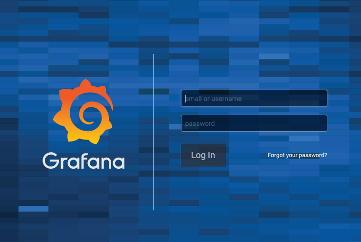
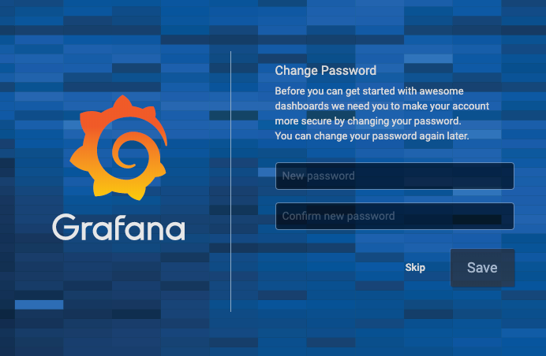

# Grafana

Grafana is an open source solution for running data analytics, pulling up metrics that make sense of the massive amount of data & to monitor our apps with the help of cool customizable dashboards.

Grafana connects with every possible data source, commonly referred to as databases such as Graphite, Prometheus, Influx DB, ElasticSearch, MySQL, PostgreSQL etc.

Grafana being an open source solution also enables us to write plugins from scratch for integration with several different data sources.

The tool helps us study, analyse & monitor data over a period of time, technically called time series analytics.

It helps us track the user behaviour, application behaviour, frequency of errors popping up in production or a pre-prod environment, type of errors popping up & the contextual scenarios by providing relative data.

A big upside of the project is it can be deployed on-prem by organizations which do not want their data to be streamed over to a vendor cloud for security & other reasons.

Over time this framework has gained a lot of popularity in the industry & is deployed by big gunssuch as PayPal, eBay, Intel & many more.

Besides the core open source solution there are other two services offered by the Grafana team for businesses known as the Grafana Cloud & the Enterprise.

## Deploying Grafana

By now, we have deployed the core of our monitoring system (metric scrape and storage), it is time too put it all together and create dashboards.

```bash
kubectl apply -f grafana
```

> ```console
> configmap/grafana-datasources created
> persistentvolumeclaim/grafana-claim created
> deployment.apps/grafana created
> service/grafana created
> ```

This will create the following:

1. Grafana deployment with 1 replica running.
2. Service with Loadbalancer IP, which can be accessed directly.

```bash
kubectl get pods -n monitoring -l k8s-app=grafana
```

> ```console
> NAME                       READY   STATUS    RESTARTS   AGE
> grafana-84b8955f44-vwcng   1/1     Running   0          2m5s
> ```

```bash
kubectl get svc -n monitoring -l k8s-app=grafana
```

> ```console
> NAME      TYPE           CLUSTER-IP       EXTERNAL-IP    PORT(S)          AGE
> grafana   LoadBalancer   10.105.214.254   10.10.99.122   3000:30652/TCP   4m25s
> ```

We Deployed a ConfigMap kind and we add the following information:


All you need to do now is to add the prometheus server as the data source in grafana and start creating dashboards. Use the following config:

Name: prometheus
Type: Prometheus
URL: http://prometheus-service:8080

We already deployed a ConfigMap kind and this step should be completed.

Note: We are using the prometheus service name in the URL section because both grafana and prometheus servers are deployed in the same cluster. In case the grafana server is outside the cluster, then you should use the prometheus service’s external IP in the URL.

Access to: http://<LOAD_BALANCER_IP>:3000 
In my example http://10.10.99.122:3000



Use the following default username and password to login. Once you login with default credentials, it will prompt to change the default password.

User: admin
Pass: admin



Re-enter the same username and password:

User: admin
Pass: admin


You have completed the installation.

[Back](lab14.md)