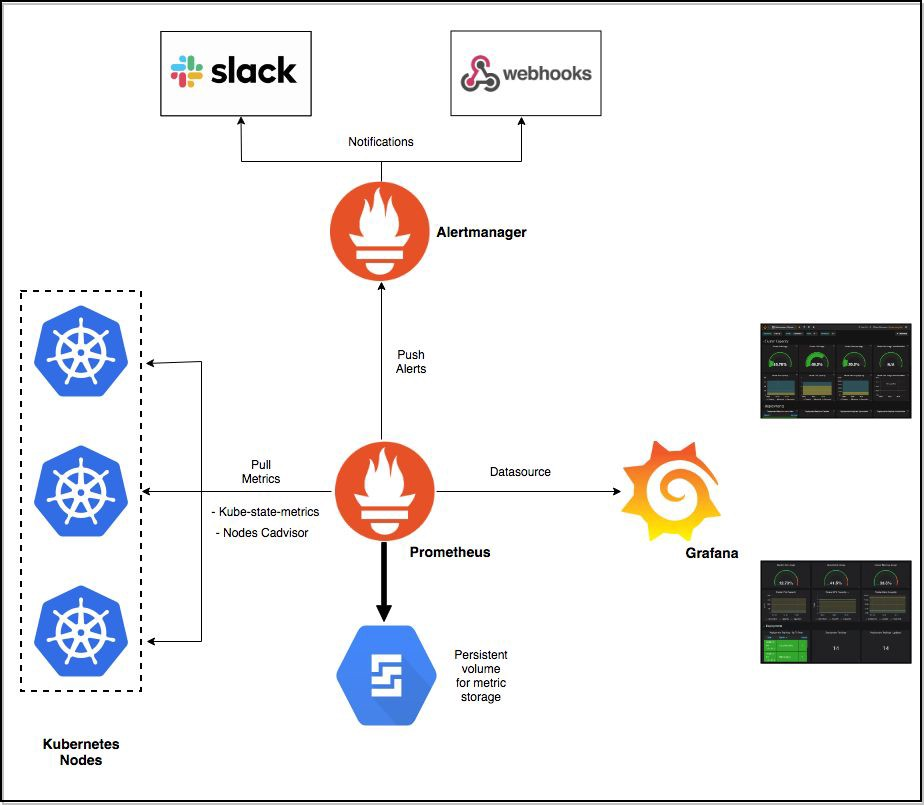

# Production Grade Monitoring with Prometheus

Monitoring is a crucial aspect of any Ops pipeline and for technologies like Kubernetes which is a rage right now, a robust monitoring setup can bolster your confidence to migrate production workloads from VMs to Containers.

Today we will deploy a Production grade Prometheus based monitoring system, in less than 5 minutes.

## Prerequisites

1. Running Kubernetes cluster with at least 6 cores and 8 GB of available memory. I will be using a 6 node GKE for this tutorial.
2. Working knowledge of Kubernetes Deployments and Services.

## Setup

1. __Prometheus__ server with persistent volume. This will be our metric storage (TSDB).
2. __Alertmanager__ server which will trigger alerts to Slack/Hipchat and/or Pagerduty/Victorops etc.
3. __Kube-state-metrics__ server to expose container and pod metrics other than those exposed by cadvisor on the nodes.
4. __Grafana__ server to create dashboards based on prometheus data.

[Back](lab14.md)
