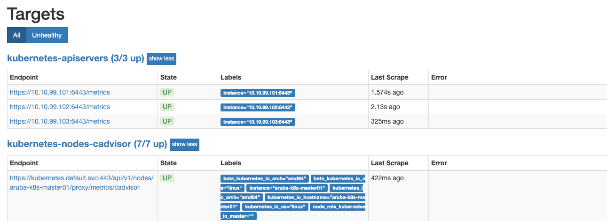

# Prometheus

## What is Prometheus?

Prometheus is an open-source systems monitoring and alerting toolkit originally built at SoundCloud. Since its inception in 2012, many companies and organizations have adopted Prometheus, and the project has a very active developer and user community. It is now a standalone open source project and maintained independently of any company. To emphasize this, and to clarify the project's governance structure, Prometheus joined the Cloud Native Computing Foundation in 2016 as the second hosted project, after Kubernetes.

### Features
Prometheus's main features are:

- a multi-dimensional data model with time series data identified by metric name and key/value pairs
- PromQL, a flexible query language to leverage this dimensionality
- no reliance on distributed storage; single server nodes are autonomous
- time series collection happens via a pull model over HTTP
- pushing time series is supported via an intermediary gateway
- targets are discovered via service discovery or static configuration
- multiple modes of graphing and dashboarding support

### Components
The Prometheus ecosystem consists of multiple components, many of which are optional:

- the main Prometheus server which scrapes and stores time series data
- client libraries for instrumenting application code
- a push gateway for supporting short-lived jobs
- special-purpose exporters for services like HAProxy, StatsD, Graphite, etc.
- an alertmanager to handle alerts
- various support tools

Most Prometheus components are written in Go, making them easy to build and deploy as static binaries.

### Architecture

This diagram illustrates the architecture of Prometheus and some of its ecosystem components:


Prometheus scrapes metrics from instrumented jobs, either directly or via an intermediary push gateway for short-lived jobs. It stores all scraped samples locally and runs rules over this data to either aggregate and record new time series from existing data or generate alerts. Grafana or other API consumers can be used to visualize the collected data.

### When does it fit?

Prometheus works well for recording any purely numeric time series. It fits both machine-centric monitoring as well as monitoring of highly dynamic service-oriented architectures. In a world of microservices, its support for multi-dimensional data collection and querying is a particular strength.

Prometheus is designed for reliability, to be the system you go to during an outage to allow you to quickly diagnose problems. Each Prometheus server is standalone, not depending on network storage or other remote services. You can rely on it when other parts of your infrastructure are broken, and you do not need to setup extensive infrastructure to use it.

### When does it not fit?

Prometheus values reliability. You can always view what statistics are available about your system, even under failure conditions. If you need 100% accuracy, such as for per-request billing, Prometheus is not a good choice as the collected data will likely not be detailed and complete enough. In such a case you would be best off using some other system to collect and analyze the data for billing, and Prometheus for the rest of your monitoring.

## Deploying Prometheus

Before deploying, please create a PV and a PVC and name it as prometheus-volume (This is important because the pvc will look for a volume in this name).

```bash
kubectl apply -f prometheus
```

> ```bash
> namespace/monitoring unchanged
> serviceaccount/monitoring created
> clusterrolebinding.rbac.authorization.k8s.io/monitoring created
> namespace/monitoring unchanged
> configmap/prometheus-server-conf created
> namespace/monitoring unchanged
> configmap/prometheus-rules created
> persistentvolumeclaim/prometheus-claim created
> deployment.apps/prometheus-deployment created
> service/prometheus-service created
> ```

This will create the following:

1. Service account, cluster-role and cluster-role-binding needed for prometheus.
2. Prometheus config map which details the scrape configs and alertmanager endpoint. It should be noted that we can directly use the alertmanager service name instead of the IP. If you want to scrape metrics from a specific pod or service, then it is mandatory to apply the prometheus scrape annotations to it. For example: 

```yaml
...
spec:
  replicas: 1
  template:
    metadata:
      annotations:
        prometheus.io/path: <path_to_scrape>
        prometheus.io/port: "80"
        prometheus.io/scrape: "true"
      labels:
        app: myapp
  spec:
...
```

3. Prometheus config map for the alerting rules. Some basic alerts are already configured in it (Such as High CPU and Mem usage for Containers and Nodes etc). Feel free to add more rules according to your use case.
4. Storage class, persistent volume and persistent volume claim for the prometheus server data directory. This ensures data persistence in case the pod restarts.
5. Prometheus deployment with 1 replica running.
6. Service with Loadbalancer IP which can be accessed directly.

kubectl get pods -l app=prometheus-server -n monitoring

NAME                                     READY   STATUS    RESTARTS   AGE
prometheus-deployment-5fc9b49dcb-lwlv9   1/1     Running   0          2m54s

kubectl get svc -l name=prometheus -n monitoring

NAME                 TYPE           CLUSTER-IP       EXTERNAL-IP    PORT(S)          AGE
prometheus-service   LoadBalancer   10.104.159.231   10.10.99.121   8080:31446/TCP   5m47s

kubectl get configmap -n monitoring

NAME                     DATA   AGE
alertmanager             1      28m
prometheus-rules         1      10m
prometheus-server-conf   1      10m

In your browser, navigate to http://<Prometheus-Svc-Ext-Ip>:8080 and you should see the prometheus console. It should be noticed that under the Status->Targets section all the scraped endpoints are visible and under Alerts section all the configured alerts can be seen.



kubectl apply -f kube-state-metrics/

namespace/monitoring unchanged
clusterrolebinding.rbac.authorization.k8s.io/kube-state-metrics created
clusterrole.rbac.authorization.k8s.io/kube-state-metrics created
rolebinding.rbac.authorization.k8s.io/kube-state-metrics created
role.rbac.authorization.k8s.io/kube-state-metrics-resizer created
serviceaccount/kube-state-metrics created
deployment.apps/kube-state-metrics created
service/kube-state-metrics created

This will create the following:

1. Service account, cluster-role and cluster-role-binding needed for kube-state-metrics.
2. Kube-state-metrics deployment with 1 replica running.
3. In-cluster service which will be scraped by prometheus for metrics. ( Note the annotion attached to it.

kubectl get pods -l k8s-app=kube-state-metrics -n monitoring

NAME                                  READY   STATUS    RESTARTS   AGE
kube-state-metrics-78c669695b-sgt94   2/2     Running   0          65s

kubectl get svc  -l k8s-app=kube-state-metrics -n monitoring

NAME                 TYPE        CLUSTER-IP     EXTERNAL-IP   PORT(S)             AGE
kube-state-metrics   ClusterIP   10.107.1.146   <none>        8080/TCP,8081/TCP   100s

[Back](lab14.md)
