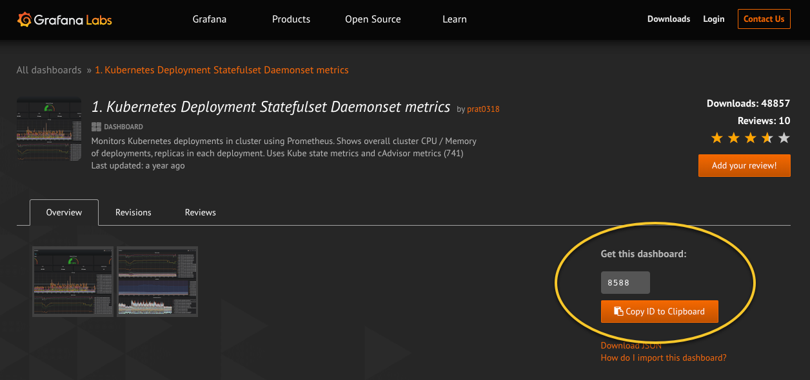
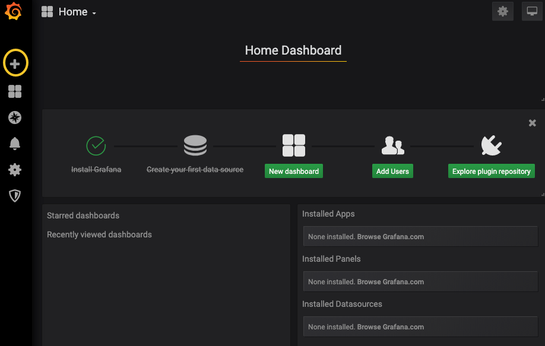
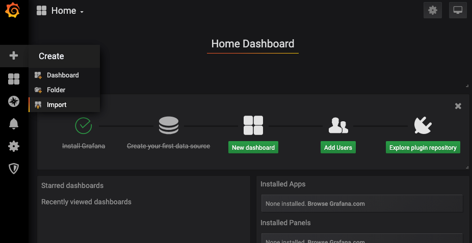
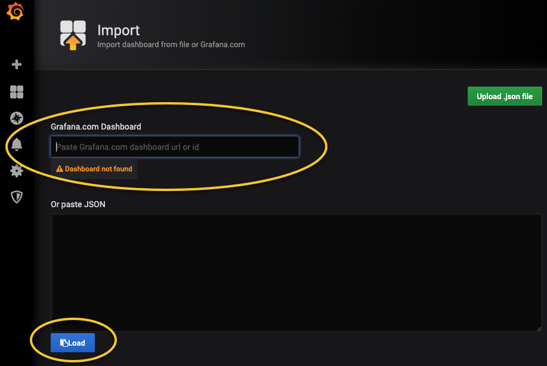
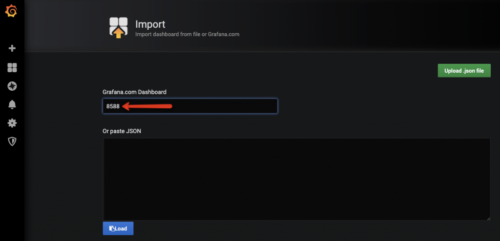
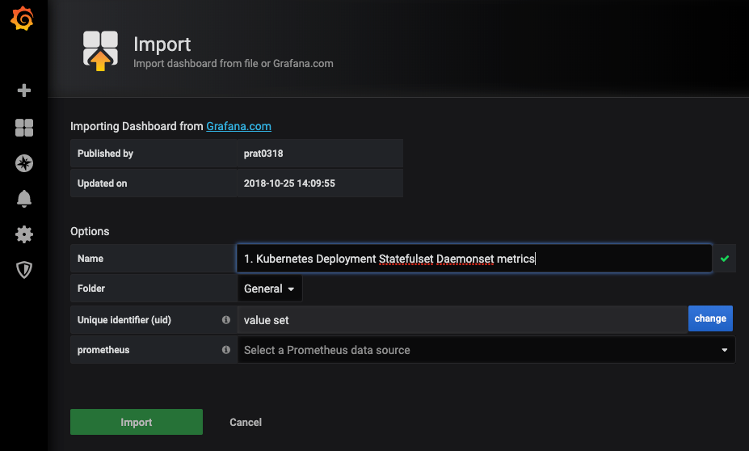
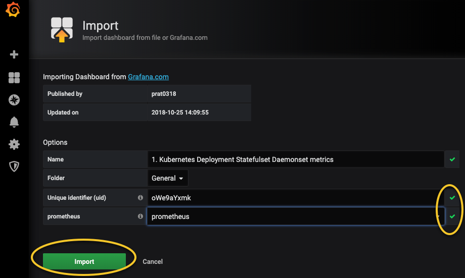

# Setup Kubernetes Dashboard

The dashboards pull data from the plugged-in data sources such as Graphite, Prometheus, Influx DB, ElasticSearch, MySQL, PostgreSQL etc.  These are a few of many data sources which Grafana supports by default.

The dashboards contain a gamut of visualization options such as geo maps, heat maps, histograms, all the variety of charts & graphs which a business typically requires to study data.

A dashboard contains several different individual panels on the grid. Each panel has different functionalities.

There are many prebuilt Grafana templates available for various data sources. [You can check out the templates from here](https://grafana.com/grafana/dashboards?search=kubernetes).

Setting up a dashboard from a template is pretty easy. Follow the steps given below to setup a dashboard to monitor kubernetes deployments.

1. Get the template ID from [grafana public template](https://grafana.com/grafana/dashboards/8588). as shown below.

2. Head over to grafana and select the import option.

3. Enter the dashboard ID you got it step 1

4. Grafana will automatically fetch the template from Grafana website. You can change the values as shown in the image below and click import.

5. Click Import

You should see the dashboard immediately.

Grafana is a very powerful tool when it comes to dashboards. It is used by many organisations to monitor its workloads. Let us know how you are using Grafana in your organisation.

[Back](lab14.md)
